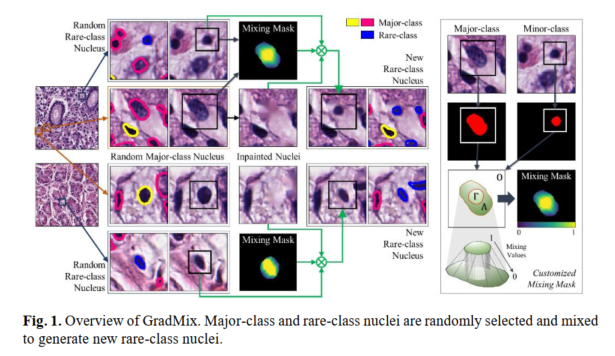

# Grad_mix : GradMix for nuclei segmentation and classification in imbalanced pathology image datasets
by Tan Nhu Nhat Doan, Kyungeun Kim2, Boram Song, and Jin Tae Kwak.

## Introduction
This repository is for our MICCAI 2022 paper [GradMix for nuclei segmentation and classification in imbalanced pathology image datasets]
(https://link.springer.com/chapter/10.1007/978-3-031-16434-7_17).




GradMix takes a pair of a major-class nucleus and a rare-class nucleus, creates a customized mixing mask, and combines them using the mask to generate a new rare-class nucleus. As it combines two nuclei,
GradMix considers both nuclei and the neighboring environment by using the customized mixing mask. This allows us to generate realistic rare-class nuclei with varying environments.
## Requirements
  
-   python  3.6.10
-   scikit-learn 0.23.1
-   scikit-image 0.16.2
-   opencv-python 4.1.2.32
-   Other packages in requirements.txt

## Usage
Prerequisite: Dataset images, cell/nuclei instance masks and cell/nuclei centroids 
1. Clone the repository and set up the folders in the following structure:
```
 ├── data 
 |   |── Images (Raw)
 |   |── Labels (Raw) 
 |   |── Grad_mix_Images  (output dir: New Sythesized Images)       
 |   |── Grad_mix_Labels  (output dir: New Sythesized Labels) 
 |   |── Inapinted_Images (output dir: New Sythesized Inpainted Images) 
 ├──

```
2. Run the jupyter file (grad_mix.ipynb) and new grad_mix images and labels will be stored in the outdirs as mentioned.
3. For Training and Testing of nuclei segmentaion and classification tasks please refer to our other repository.
Repository: [Sonnet:A self-guided ordinal regression neural network for segmentation and classification of nuclei in large-scale multi-tissue histology images](https://github.com/QuIIL/Sonnet)

## Citation
If Grad_mix is useful for your research, please consider citing following two papers:
```angular2html
@inproceedings{doan2022gradmix,
  title={GradMix for Nuclei Segmentation and Classification in Imbalanced Pathology Image Datasets},
  author={Doan, Tan Nhu Nhat and Kim, Kyungeun and Song, Boram and Kwak, Jin Tae},
  booktitle={International Conference on Medical Image Computing and Computer-Assisted Intervention},
  pages={171--180},
  year={2022},
  organization={Springer}
}
@article{doan2022sonnet,
  title={SONNET: A self-guided ordinal regression neural network for segmentation and classification of nuclei in large-scale multi-tissue histology images},
  author={Doan, Tan NN and Song, Boram and Vuong, Trinh TL and Kim, Kyungeun and Kwak, Jin T},
  journal={IEEE Journal of Biomedical and Health Informatics},
  volume={26},
  number={7},
  pages={3218--3228},
  year={2022},
  publisher={IEEE}
}
```
